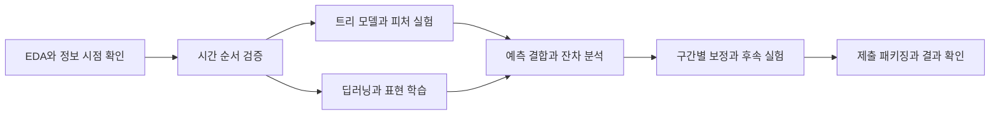

# LG Aimers 9기 · 투구 제구 성공 확률 예측

**떡잎마을방범대 | 리더보드 캡처 기준 63위 · 1,162.43634점**

투구 직전의 경기 상황과 과거 선수 이력으로 제구 성공 확률을 예측한 팀 프로젝트입니다.
이 저장소에는 **데이터를 어떻게 해석했고 어떤 모델과 피처를 실험했으며 무엇을 채택하거나 기각했는지**를 정리했습니다.

| 항목 | 내용 |
|---|---|
| 대회 | [LG Aimers 9기 온라인 해커톤](https://dacon.io/competitions/official/236743/overview/description) |
| 기간 | 2026.08.05–2026.09.02, Phase 2 |
| 주최 / 주관 | LG AI 연구원 / 데이콘 |
| 예측 대상 | 각 투구의 `control_success = 1`일 확률 |
| 평가 | Brier Skill Score — 확률값 자체의 오차 평가 |
| 실험 모델 | RandomForest, Logistic Regression, CatBoost, LightGBM, XGBoost, FT-Transformer, RealMLP, SAINT, DCN, DeepFM, TabM |
| 개발·검증 | Python, pandas, NumPy, scikit-learn, PyTorch, 시간 순서 검증, 앙상블, 독립 실행 패키징 |

> 순위와 점수는 팀 제공 캡처의 표시값입니다. 코드 검증 후 확정 순위나 특정 최종 ZIP과의 연결을 뜻하지 않습니다. [제출 기록과 결과 해석](docs/results.md)

## 1. 어떤 문제를 풀었나

제구 성공은 단순히 스트라이크 여부와 같지 않습니다. 이 대회에서는 공이 가운데로 몰리거나, 존에서 크게 벗어나거나, 포수의 요구 방향과 반대로 들어가는 경우 등을 실패로 정의합니다.
우리는 공이 도착한 위치를 본 뒤 분류하는 대신, **던지기 전에 알 수 있는 정보로 성공 가능성을 추정**해야 했습니다.

실험에서 확인하려던 질문은 세 가지였습니다.

1. 투수의 장기 이력과 최근 경기 기록 중 어떤 정보가 다음 투구에 도움이 되는가?
2. 시즌과 경기 유형이 달라져도 같은 피처와 보정 방식이 유지되는가?
3. 강한 단일 모델이 남긴 오차를 다른 모델이나 상황별 보정이 줄일 수 있는가?

## 2. 대회는 이렇게 진행했다

ML·DL·앙상블 실험을 병행했습니다. 아래 진행 흐름에는 날짜별 일지 대신 기록에 남은 질문과 실험 간 의존 관계를 정리했습니다.

| 단계 | 주요 작업 | 다음 실험으로 이어진 판단 |
|---|---|---|
| 데이터 이해 | 결측, 과거 이력, 시즌별 변화, 경기 상황, TrackMan ID 체계 분석 | 이력 없음과 낮은 성공률을 구분하고 과거→미래 검증 채택 |
| 기준선 구축 | RandomForest·로지스틱 회귀, 이후 트리 모델 비교 | 복잡한 모델의 효과를 비교할 기준을 정함 |
| 피처·트리 개선 | CatBoost·LightGBM·XGBoost, 최근성·피처 블록·범주 처리 비교 | 단일 최고 점수와 모델마다 다른 오차 구조를 함께 비교 |
| 딥러닝 탐색 | FT-Transformer·RealMLP·SAINT, 의미별 피처 묶음과 잔차 학습 | 독립 성능과 기존 모델에 더해지는 정보량을 검사 |
| 앙상블 개선 | 도메인·투구 의도 expert, TabM head 결합, 좌우타 상대 효과, 조건부 혼합 | 어느 구간에서 누구의 예측을 믿을지 검증 |
| 후반 개선·제출 준비 | No1·No2 재구성, JJO 잔차·그래프·카운트 실험, 추론 패키지 검사 | 내부 성능, 실제 제출 결과, 실행 일치성을 각각 기록 |

이 그림은 연구 과정의 개요입니다. 개별 실험의 구성과 채택 여부는 아래 기록에서 설명합니다.

## 3. EDA에서 모델링 가설로

| 관찰한 문제 | 모델링에 반영한 질문·처리 |
|---|---|
| 누적 이력과 최근 1·3·5경기 이력의 결측 의미가 다름 | 이력 유무를 표시하고 장기 수준과 최근 상태를 나누어 비교 |
| 연도별 성공률과 경기 유형별 양상이 달라짐 | 무작위 분할 대신 시간 순서 검증, Regular/Futures 구간별 오차 확인 |
| 투수·타자 ID는 고유값이 많고 신규 선수도 등장 | ID 의존도, 과거 표본 수, 미관측 선수 구간을 별도 점검 |
| main과 TrackMan의 ID 체계가 서로 다름 | 숫자가 같다고 가정한 직접 조인은 배제하고 이력 대응·물리 표현을 별도 가설로 검증 |
| 구속·릴리스·무브먼트는 손 유형과 구종군에 따라 다름 | 전체 평균 대신 조건별 물리 특성·변동성·표본 수를 후보로 검토 |

분석에서 차이가 보인다고 곧바로 유효한 피처로 쓸 수는 없었습니다. 예를 들어 물리 정보가 설명력이 있어 보여도
선수 대응과 사용 시점을 보장할 수 있는지 확인하고 기존 모델 대비 추가 개선이 있는지도 살폈습니다.

→ [EDA부터 ML·DL 모델링까지](docs/modeling.md)

## 4. 비교 기준과 검증 설계

| 학습 구간 | 검증 구간 |
|---|---|
| 2019–2021 | 2022 |
| 2019–2022 | 2023 |
| 2019–2023 | 2024 |

Brier는 낮을수록 좋습니다. 공식 점수는 해당 평가셋의 평균 성공률을 기준으로 Brier를 환산합니다.
**내부 검증 점수와 리더보드 점수는 같은 숫자 축에 놓고 개선 이력으로 합치지 않았습니다.**

평균 성능 외에 경기 유형, 과거 표본 수, 신규 선수, seed별 변동과 확률 보정을 함께 확인했습니다.
후속 탐색에서 반복 관찰한 2024 결과는 사후 확인으로 표시했습니다. 독립적인 미관측 평가로 볼 수 없기 때문입니다.

→ [정보 시점·피처·검증 설계](docs/methods.md)

## 5. 주요 실험에서 내린 결정

| 실험 | 시도와 관찰 | 판단 |
|---|---|---|
| ML-015 | CatBoost 244개 피처·3개 seed를 고정. 연도별 Brier가 0.243154 / 0.252100 / 0.247747로 달랐음 | 튜닝 전에 기준선의 설정을 고정하고 평균과 연도별 안정성을 함께 확인 |
| ENS-002 | 월별 잔차 반영량으로 2024 내부 점수가 972.45→975.02 상승했지만 실제 제출은 기준보다 하락 | 달력 기반 보정을 최종 채택하지 않음 |
| ENS-003 | TabM head 결합과 좌우타 상대 효과를 개선. `platoon_slope`의 실제 제출 기록은 1,126.33191068점 | 모델 평균과 특정 오차를 보완하는 구조를 함께 탐색 |
| ENS-032 | LightGBM에 XGBoost를 조건부 결합. 2024 내부 점수 783.31→810.76 | 신규 투수에 큰 보정을 주던 방향을 버리고 이력이 충분한 Regular 구간에 반영량을 높임 |
| ENS-044/045 | 고정 비율 혼합은 검증 Brier를 개선했고 패키지 일치성도 확인 | 당시 제출 기준 후보를 넘지 못한 구성은 예비안으로 보관 |
| 후반 No1·No2·JJO | 기반 모델 재구성, 잔차 학습, 경기 맥락·그래프·카운트별 개선 | 기준 모델과 실험 조건을 명시하고 개선·실패·제출 준비 상태를 구분 |

이 표의 내부 지표는 각각 해당 실험의 검증 조건에서 나온 값입니다. 서로 다른 모델의 전체 성능 순위표가 아닙니다.
세부 설정, 기각한 대안, 후반 실험의 결과는 [앙상블·후속 개선 기록](docs/experiments.md)에 정리했습니다.

## 6. 결과와 회고

팀 제공 리더보드 캡처의 결과는 **63위, 1,162.43634점**입니다.
연구 과정에서는 모델을 더 복잡하게 만들기보다 **어느 구간에서 틀리는지 찾고 보정의 효과가 다음 시즌에도 유지되는지**를 더 중요하게 봤습니다.

- **로컬 개선이 제출 결과에 전이되는지 확인했다.** 월별 보정처럼 내부 검증에서 좋아도 제출 결과가 나빠지는 시도가 있었습니다.
- **단일 모델 성능과 앙상블 가치를 구분했다.** 단독 성능이 낮은 모델도 다른 오차를 만들면 특정 구간에서 도움이 됐습니다.
- **개선되지 않은 실험도 남겼다.** 딥러닝 표현 변경, 희소 구간 보정, 최근성 가설의 실패가 다음 실험의 범위를 좁혔습니다.
- **제출 가능한 코드와 제출할 모델은 별개였다.** 패키지 실행 검증을 통과했더라도 성능 근거가 부족하면 예비안으로 남겼습니다.

[결과·회고](docs/results.md)에 전체 제출 근거와 대회를 다시 진행한다면 바꿀 점을 정리했습니다.

## 7. 상세 기록 읽기

| 문서 | 내용 |
|---|---|
| [모델링 과정](docs/modeling.md) | EDA, 피처 가설, 트리·딥러닝 실험과 해석 |
| [앙상블 실험 기록](docs/experiments.md) | 초기 결합부터 No1·No2·JJO 후속 개선까지 |
| [설계와 검증](docs/methods.md) | 입력 정보, 시간 분할, 잔차·확률 보정, 추론 원칙 |
| [결과와 회고](docs/results.md) | 실제 제출 기록, 내부 검증과의 차이, 배운 점 |
| [팀 기여와 출처](docs/attribution.md) | 협업 방식과 기록·코드의 출처 |
| [실행 안내](docs/reproduction.md) | 실행 환경과 재현 범위 |
| [문서 구성 참고 사례](docs/references.md) | 한국어 해커톤·경진대회 GitHub 사례와 반영한 구성 |

## 코드와 데이터

[전처리 구현](Preprocess/README.md)과 검증 코드는 저장소에서 확인할 수 있습니다.
원본 데이터·모델·노트북 출력은 로컬에 보존하며 [`.gitignore`](.gitignore)로 업로드에서 제외합니다.
실행에 필요한 파일과 최종 점수 재현 범위는 [실행 안내](docs/reproduction.md), 공개 조건은 [데이터·공개 안내](docs/publication.md)를 참고하세요.
